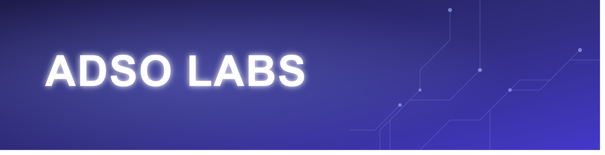

> Plataforma web de gestión académica para el programa **Análisis y Desarrollo de Software Orientado (ADSO)** del SENA.


---

## Tabla de contenido

1. [Descripción](#descripción)
2. [Características principales](#características-principales)
3. [Arquitectura](#arquitectura)
4. [Stack tecnológico](#stack-tecnológico)
5. [Módulos del sistema (Application)](#módulos-del-sistema-application)
6. [API REST — Controllers](#api-rest--controllers)
7. [Infrastructure — persistencia y servicios técnicos](#infrastructure--persistencia-y-servicios-técnicos)
8. [Web — Blazor Server](#web--blazor-server)
9. [Entidades del dominio](#entidades-del-dominio)
10. [Primeros pasos](#primeros-pasos)
11. [Estructura del repositorio](#estructura-del-repositorio)
12. [Documentación](#documentación)
13. [Contribuciones](#contribuciones)
14. [Seguridad y privacidad](#seguridad-y-privacidad)
15. [Licencia](#licencia)

---

## Descripción

**ADSO Labs** centraliza la gestión de fichas de formación, aprendices, instructores, competencias, asistencia, monitorías, patrocinios, juicios evaluativos, repositorio documental y predicción de compatibilidad (IA) del programa ADSO del SENA. Está diseñado para operar bajo los lineamientos de SOFIA Plus y cumplir con la **Ley 1581 de Colombia (Habeas Data)**.

- **Metodología:** Scrum / Ágil
- **Clasificación:** Confidencial — no se deben exponer datos de aprendices o instructores en logs, commits públicos ni ejemplos.
- **Estado:** en desarrollo activo — ver `AGENTS.md` §4 para el estado detallado de cada módulo.

Esta sección del README y las que siguen están pensadas como **guía completa para alguien que nunca vio el proyecto**: qué hace cada capa, qué controller/servicio tocar para cada tarea, y cómo levantar el entorno local.

---

## Características principales

- Gestión completa de fichas de formación con seguimiento de horas, competencias y aprendices.
- Importación atómica del **Reporte de Juicios Evaluativos** de SOFIA Plus (`.xls`), más importación masiva de fichas y aprendices por plantilla Excel (`.xlsx`).
- Programación por resultado de aprendizaje, con control de conflictos de horario del instructor.
- Control de asistencia por sesión, con una única regla real de detección de aprendices **En Riesgo** (3+ inasistencias consecutivas o 20% de las horas de la competencia), aplicada de forma consistente en Aprendiz, Informe individual y Reportes.
- Historial de estado del aprendiz (`HistorialEstadoAprendiz`), con auditoría transversal por interceptor de EF Core (`AuditoriaInterceptor`) sobre las entidades sensibles.
- **Fase formativa del proyecto ADSO** (Inducción → Análisis → Planeación → Ejecución → Evaluación, o Transversal): cada competencia del catálogo tiene su fase asignada, visible en Fichas > Competencias, en Asignación de Competencias, y en la pestaña **Ruta Formativa** de Fichas (Kanban que agrupa las competencias de la ficha por fase y resalta en cuál va actualmente). El dashboard de la ficha también muestra la fase actual y si está en Etapa Lectiva o Práctica (los últimos 6 meses calendario).
- **Monitorías académicas**: asignación de monitores por competencia, sesiones, inscripción de aprendices, asistencia e informes.
- **Predicción IA**: sugerencia de asignación de competencias a instructores y predicción de tendencias de aprendizaje por competencia, generadas con **Anthropic Claude Haiku**, respetando el orden curricular real del proyecto formativo y evitando sugerir competencias ya asignadas. Cada sugerencia muestra por separado la fase actual de la ficha y la fase de la competencia candidata.
- **Notificaciones en tiempo real** vía SignalR (bandeja de notificaciones por usuario).
- Gestión de patrocinios académicos en etapas Lectiva y Productiva.
- Repositorio documental con tipos parametrizables (guías, instrumentos, planeaciones, proyectos, desarrollo curricular, planes concertados).
- Perfil del aprendiz con acudiente, observaciones, cronograma y detalle de resultados de aprendizaje (código, instructor, juicio) por competencia.
- Autenticación por cookies con hashing PBKDF2-SHA256, política de contraseñas y bloqueo por intentos fallidos.
- Consentimiento informado (Ley 1581) exigido en el primer cambio de contraseña.
- Activación y recuperación de cuenta con tokens seguros y cooldown.
- Informe académico exportable a PDF (client-side con jsPDF) y reportes exportables a Excel (server-side).
- Dashboard y reportes construidos íntegramente en Blazor Server con Chart.js.
- Auditoría de accesos y de importaciones SOFIA Plus.
- Scripts de pruebas de carga con k6 (`tests/load/`) para los endpoints críticos (RNF-03).

---

## Arquitectura

ADSO Labs sigue **Clean Architecture** en cinco proyectos:

```
AdsoLabs.sln
├── AdsoLabs.Core            → Entidades base de dominio y enums de resultado
├── AdsoLabs.Application     → Casos de uso (AppServices), DTOs, interfaces de servicios y queries
├── AdsoLabs.Infrastructure  → EF Core, SMTP, hashing, importadores SOFIA, migraciones, seeder
├── AdsoLabs.API             → ASP.NET Core Web API (20 controllers)
└── AdsoLabs.Web             → Blazor Server (UI funcional, 29 páginas)
```

**Regla de dependencias:**

```
Web → API → Application → Core ← Infrastructure
```

- `Core` no depende de ninguna otra capa. Contiene solo las entidades base (`Persona`, `Usuario`, `Rol`, `TipoDocumento`, `Ficha`, `Competencia`, `FichaCompetencia`, `AprendizPerfil`, `InstructorPerfil`, `PasswordResetToken`) y enums de resultado (`ResultadoActivacion`, `ResultadoAgregar`, `ResultadoEnvioToken`).
- **Todas las demás entidades** (Asistencia, Patrocinio, Monitoría, Notificación, Auditoría, repositorio documental, etc. — ver [Entidades del dominio](#entidades-del-dominio)) viven en `AdsoLabs.Infrastructure/Models`, no en `Core`. Es una decisión de diseño consciente: `Core` guarda el núcleo de identidad/dominio puro, `Infrastructure/Models` es el resto del modelo persistido vía EF Core.
- `Infrastructure` implementa interfaces definidas en `Application` (servicios, repositorios, queries).
- `Web` **no llama directamente a la API HTTP de terceros**; consume `AdsoLabs.API` a través de `HttpClient` (un `*ApiService.cs` por módulo) y nunca referencia `Infrastructure` ni `Core` directamente.

---

## Stack tecnológico

| Capa | Tecnología |
|------|-----------|
| Frontend | Blazor Server (.NET 9) + Razor Pages handlers (login/activación/recuperación) |
| Backend | ASP.NET Core Web API (.NET 9) |
| ORM | Entity Framework Core 9 + SQL Server 2019+ |
| Autenticación | ASP.NET Core Authentication.Cookies (esquema `AdsoLabs.Auth`), configurada en `AdsoLabs.Web` |
| Hashing | PBKDF2-SHA256 (100.000 iteraciones, salt 16B, hash 32B) |
| Correo | MailKit + MimeKit (compatible SendGrid) |
| Importación Excel | ExcelDataReader 3.x (lectura) + generación de plantillas propias (escritura) |
| Tiempo real | SignalR (`NotificacionHub`, grupo por usuario) |
| IA | **Anthropic Claude Haiku** (`claude-haiku-4-5-20251001`, API nativa de Messages) para predicción de compatibilidad/aprendizaje — migrado desde Groq/LLaMA 3.3 |
| UI | Bootstrap 5 |
| Informes PDF | jsPDF (client-side) |
| Reportes Excel | Generación server-side (`InformeExcelGenerator`) |
| Reportes y Dashboard | Blazor Server + Chart.js vía JSInterop |
| Pruebas de carga | k6 (`tests/load/`) |
| Almacenamiento archivos | `LocalArchivoStorageService` (disco local, decisión firme — no se integra SharePoint) |

### Decisiones arquitectónicas firmes (y por qué)

Estas tres decisiones son intencionales, no defaults por omisión. Se documentan aquí para no tener que reexplicarlas caso por caso:

- **Autenticación por cookies, no JWT.** El único cliente real de `AdsoLabs.API` es `AdsoLabs.Web` (Blazor Server, renderizado en el servidor) — no hay app móvil, SPA de terceros ni integraciones externas que necesiten un token portable y sin estado. Con ese escenario, una cookie de sesión (`HttpOnly`, `Secure`) evita exponer un token en `localStorage`/JS (vector de robo por XSS) y permite revocar una sesión de inmediato del lado del servidor; un JWT es difícil de invalidar antes de que expire sin mantener una blocklist. La contrapartida es que este esquema no sirve tal cual si en el futuro se necesita una API consumida por un cliente externo sin sesión de navegador — ahí sí tendría sentido evaluar JWT.
- **Hashing con PBKDF2-SHA256, no BCrypt.** PBKDF2 es un algoritmo aprobado por NIST/FIPS 140-2, relevante si el proyecto necesita alinearse con requisitos de cumplimiento de una entidad pública como el SENA; BCrypt no tiene esa certificación. Ambos son opciones razonables hoy — la alternativa "más moderna" para un proyecto nuevo sería Argon2, que no se adoptó aquí. 100.000 iteraciones + salt de 16 bytes es el parámetro actual; subirlo eleva el costo de fuerza bruta pero también el costo de cómputo en cada login.
- **Dashboard y reportes en Blazor Server + Chart.js, no Power BI.** Evita el costo de licenciamiento de Power BI Embedded y no requiere enviar datos de aprendices/instructores (dato sensible bajo Habeas Data) a un servicio embebido de terceros — todo el cálculo y renderizado queda autohospedado. La contrapartida es que hay que construir y mantener la lógica de visualización a mano en vez de apoyarse en las herramientas ya maduras de Power BI.

> **Nota sobre el token interno API↔Web:** lo anterior describe la autenticación **de cara al navegador** (cookie). `AdsoLabs.Web` y `AdsoLabs.API` son procesos separados y el navegador nunca habla directo con la API — todas las llamadas son servidor-a-servidor vía `HttpClient`. Para que la API valide quién llama sin depender de la cookie (que no viaja entre procesos), `AdsoLabs.Web` mintea un **JWT interno de vida corta (2 min)** por cada llamada saliente, a partir del `ClaimsPrincipal` ya autenticado (`InternalTokenHandler.cs`), firmado con una clave simétrica compartida en configuración local. Ese JWT nunca llega al navegador — es un detalle de implementación interno, no contradice la decisión de "cookies, no JWT" de cara al cliente.

---

## Módulos del sistema (Application)

### ¿Qué es un AppService?

Un `AppService` es la clase que implementa un **caso de uso completo** del sistema — es la capa que un controller de la API llama directamente. No es un repositorio (no sabe de SQL/EF Core) ni un controller (no sabe de HTTP/`IActionResult`): orquesta el flujo de negocio de principio a fin para una acción concreta, por ejemplo "agregar un instructor" o "programar un resultado de aprendizaje".

En la práctica, un `AppService`:
- Recibe y devuelve **DTOs** (`Application/DTOs/<Modulo>/`), nunca entidades de `Infrastructure/Models` directamente — así el controller y el resto del sistema no dependen del modelo de datos interno.
- Llama a **repositorios** (`Interfaces/Services` + implementación en `Infrastructure/Services`) para escritura/lógica de negocio, y a **queries** (`Interfaces/Queries` + implementación en `Infrastructure/Queries`) para lecturas/proyecciones — separación CQRS ligera: los queries proyectan directo a DTO con `.Select()`, sin materializar la entidad completa.
- Contiene las reglas de negocio del caso de uso (validaciones, orden de pasos, qué hacer si algo falla) — es el lugar correcto para esa lógica, no el controller (que debe quedar delgado) ni el repositorio (que debe quedar tonto).
- Se registra en `Program.cs` de `AdsoLabs.API` como `Scoped` y se inyecta por constructor en su(s) controller(s) correspondiente(s).

Ejemplo de la cadena completa para "obtener el dashboard de un usuario": `DashboardController` (HTTP) → `DashboardAppService` (caso de uso) → `IDashboardQueryService`/`DashboardQueryService` (proyección EF Core a DTO) → respuesta JSON.

Cada módulo tiene su `AppService` en `AdsoLabs.Application/AppService/<Modulo>/`, con DTOs propios en `DTOs/<Modulo>/`:

| Módulo | AppService | Responsabilidad |
|--------|------------|------------------|
| ActivacionCuenta | `ActivacionCuentaAppService` | Activación de cuentas nuevas (token por correo). |
| Aprendiz | `AprendizAppService` | CRUD de aprendices, vinculación a fichas, cambios de estado. |
| Asistencia | `AsistenciaAppService` | Registro y consulta de asistencia por sesión. |
| Auth | `AuthAppService` | Login, primer login, cambio de contraseña. |
| Competencia | `CompetenciaAppService` | Catálogo de competencias. |
| Dashboard | `DashboardAppService` | Resúmenes y alertas para el dashboard del usuario. |
| Fichas | `FichaAppService` | CRUD de fichas, competencias asociadas, recálculo de estados. |
| Importacion | `ImportacionAppService` | Orquesta importación de fichas, aprendices y juicios SOFIA. |
| Informe | `InformeAppService` | Informe académico del aprendiz, acudiente, observaciones. |
| Instructor | `InstructorAppService` | CRUD de instructores, asignación a fichas/competencias. |
| Monitoria | `MonitoriaAppService` | Monitores, sesiones de monitoría, inscripción, asistencia e informes. |
| Patrocinio | `PatrocinioAppService` | Patrocinios (Lectiva/Productiva), horarios, asistencia. |
| Perfil | `PerfilAppService` | Perfil de aprendiz/instructor: datos, contacto, cronograma. |
| PrediccionIA | `PrediccionIAAppService` | Compatibilidad y predicción de aprendizaje vía Anthropic Claude Haiku, respetando la fase formativa de la ficha. |
| Programacion | `ProgramacionAppService` | Programación de resultados de aprendizaje por instructor. |
| RecuperacionPassword | `RecuperacionPasswordAppService` | Tokens y cambio de contraseña olvidada. |
| Reportes | `ReportesAppService` | Reportes académicos (asistencia, competencias, juicios, patrocinio) en pantalla y Excel. |
| Repositorio | `RepositorioAppService` | Gestión documental (guías, instrumentos, planeaciones, proyectos, etc.). |

Las interfaces de estos servicios viven en `Application/Interfaces/Services/` (lógica de escritura) y `Application/Interfaces/Queries/` (lecturas/proyecciones), separadas por módulo.

---

## API REST — Controllers

Todos los controllers están en `AdsoLabs.API/Controllers/`, bajo prefijo `api/` con nombres descriptivos en español. Son delgados y delegan al `AppService` correspondiente — la lógica de negocio vive en `Application`, no aquí.

### Autenticación y autorización

Por defecto **todo endpoint exige un token válido** (`AuthorizeFilter` global en `Program.cs`); solo se marcan `[AllowAnonymous]` los que deben ser accesibles sin sesión (login, activación, recuperación de password). El token que valida la API es un **JWT interno de 2 minutos**, minteado por `AdsoLabs.Web` a partir de la cookie del usuario y nunca expuesto al navegador (`InternalTokenHandler.cs` en Web, `AddJwtBearer` en la API) — ver la nota en [Stack tecnológico](#stack-tecnológico). Cada controller tiene `[Authorize(Roles = "...")]` espejando la restricción de rol de su página Blazor correspondiente; se indica en la columna **Rol** de cada tabla de abajo. `PerfilController`, `NotificacionController` (y `MonitoriaController`, cuando se mergee) no tienen restricción de rol propia — solo exigen *estar autenticado*, porque sirven a los 3 roles por igual (cada quien ve/gestiona sus propios datos).

#### SELF vs. LOOKUP

Algunas tablas de abajo tienen una columna **id** con la marca **SELF** o **LOOKUP** — indica cómo se protege ese endpoint contra pedir datos de otro usuario cambiando un parámetro (patrón de seguridad conocido como [IDOR](https://owasp.org/www-community/attacks/Insecure_Direct_Object_Reference)):

- **SELF** — el endpoint devuelve *lo tuyo*: tu dashboard, tu perfil, tus notificaciones, tus reportes. No acepta `idUsuario`/`idInstructor` como parámetro — la API lo deriva del token (`ControllerBaseExtensions.ObtenerIdUsuarioAutenticado()`). Ej.: `GET /api/mi-dashboard` — no existe forma de pedir el dashboard de otro usuario, porque la ruta ni siquiera tiene ese parámetro.
- **LOOKUP** — el endpoint recibe un id explícito porque identifica a *otra* entidad, no a quien llama (ej. un instructor específico, un patrocinio, una ficha). Ej.: `GET /obtener-detalles-instructor?idInstructor=7`. Ahí el control de acceso es de **rol** (¿tu rol puede ver instructores?), no de identidad exacta — cualquier Administrador/Instructor puede consultar cualquier `idInstructor`.

No todas las tablas tienen esta columna: solo aparece en controllers donde, antes de la auditoría de `fix/api-auth-authorization`, existía un parámetro `idUsuario`/`idInstructor` representando *a quien llama* (ambigüedad real entre "lo mío" y "lo de otro"). Controllers como `AprendizController`, `CompetenciaController` o `AsistenciaController` solo reciben ids de **entidades de dominio** (`idAprendiz`, `numeroFicha`, `idCompetencia`) — nunca "el id de quien pregunta" — así que no hay ese riesgo que distinguir y la columna no aplica.

<details>
<summary><strong>AuthController</strong> — <code>api/</code> · público (<code>[AllowAnonymous]</code>) · <code>AuthAppService</code></summary>

| Verbo | Ruta | Descripción |
|---|---|---|
| POST | `login` | Valida credenciales (o documento si es primer login) y devuelve los datos de sesión. |
| POST | `cambiar-password-primer-login` | Establece la contraseña real en el primer inicio de sesión. |

</details>

<details>
<summary><strong>ActivacionCuentaController</strong> — <code>api/</code> · público (<code>[AllowAnonymous]</code>) · <code>ActivacionCuentaAppService</code></summary>

| Verbo | Ruta | Descripción |
|---|---|---|
| POST | `solicitar` | Documento + correo → crea el `Usuario` inactivo y envía el token de activación. |
| GET | `validar?token=` | Verifica que un token de activación siga vigente (para el formulario). |
| POST | `activar` | Establece la contraseña y activa la cuenta con el token. |

</details>

<details>
<summary><strong>PasswordController</strong> — <code>api/</code> · público (<code>[AllowAnonymous]</code>) · <code>RecuperacionPasswordAppService</code></summary>

| Verbo | Ruta | Descripción |
|---|---|---|
| POST | `enviar-token` | Envía token de recuperación al correo (con cooldown de 5 min). |
| POST | `validar-token?token=` | Verifica que el token de recuperación siga vigente. |
| POST | `cambiar-password` | Cambia la contraseña usando el token de recuperación. |

</details>

<details>
<summary><strong>EmailController</strong> — <code>api/</code> · rol: <code>Administrador</code> · <code>IEmailServices</code></summary>

| Verbo | Ruta | Descripción |
|---|---|---|
| POST | `probar` | Envía un correo de prueba — diagnóstico de la configuración SMTP. |

</details>

<details>
<summary><strong>FichaController</strong> — <code>api/</code> · rol: <code>Administrador,Instructor</code> · <code>FichaAppService</code></summary>

| Verbo | Ruta | id | Descripción |
|---|---|---|---|
| GET | `obtener-fichas` | SELF | Lista las fichas activas — todas si es Administrador, solo las asignadas si es Instructor. |
| GET | `obtener-detalles-ficha?numeroFicha=` | — | Detalle completo de una ficha (fechas, jornada, modalidad, progreso). |
| GET | `obtener-competencias-ficha?numeroFicha=&idUsuario=` | LOOKUP* | Competencias de la ficha; `idUsuario` (opcional) solo marca `EsMiCompetencia` para ese instructor — no filtra qué se devuelve. |
| GET | `obtener-aprendices-ficha?numeroFicha=` | — | Aprendices inscritos en la ficha. |

*`idUsuario` aquí es cosmético (marca cuál competencia pertenece a qué instructor), no de control de acceso — por eso no se forzó a SELF pese al patrón general. Ver commit de `fix/api-auth-authorization`.

</details>

<details>
<summary><strong>AprendizController</strong> — <code>api/</code> · rol: <code>Administrador,Instructor</code> · <code>AprendizAppService</code></summary>

| Verbo | Ruta | Descripción |
|---|---|---|
| GET | `obtener-aprendices` | Lista todos los aprendices. |
| POST | `agregar-aprendiz` | Alta manual de aprendiz (uso excepcional — el flujo normal es importar desde SOFIA). |
| PUT | `{idAprendiz}/estado?idFicha=` | Cambia el estado del aprendiz en una ficha (`EN FORMACION`, `CANCELADO`, etc.). |
| GET | `obtener-aprendices-por-ficha` | Aprendices de una ficha específica. |
| GET | `obtener-detalles-aprendiz` | Detalle completo de un aprendiz. |
| GET | `obtener-resumen-aprendices?ficha=&documento=&nombre=` | Listado filtrado para tablas. |
| GET | `filtrar-aprendices?numeroFicha=&numeroDocumento=&nombreAprendiz=` | Filtro combinado (usado en buscadores). |

</details>

<details>
<summary><strong>InstructorController</strong> — <code>api/</code> · rol: <code>Administrador,Instructor</code> (<code>agregar-instructor</code> exige además <code>Administrador</code>) · <code>InstructorAppService</code></summary>

| Verbo | Ruta | Descripción |
|---|---|---|
| GET | `obtener-instructores` | Lista todos los instructores. También permite rol `Aprendiz` (un aprendiz-monitor lo necesita para elegir el instructor destinatario de sus informes/asistencias de monitoría en "Gestión de Monitorías"); el DTO no expone datos sensibles. |
| GET | `obtener-resumen-instructores?competencia=&instructor=` | Resumen filtrado para tablas. |
| GET | `obtener-detalles-instructor?idInstructor=` | Detalle de un instructor específico (LOOKUP). |
| GET | `obtener-instructores-por-competencia?nombreCompetencia=` | Instructores que dictan una competencia. |
| GET | `filtrar-instructores?competencia=&instructor=` | Filtro combinado. |
| POST | `agregar-instructor` | **Solo Administrador.** Alta de instructor. |
| PUT | `actualizar-contacto-instructor` | El propio instructor (o un Administrador) actualiza su correo/teléfono; valida `idUsuario` del body contra el token si no es Administrador. |
| GET | `obtener-avisos-instructor?idInstructor=` | Avisos/alertas del instructor (LOOKUP). |
| PUT | `editar-instructor/{idInstructor}` | Activa/inactiva un instructor. |

</details>

<details>
<summary><strong>CompetenciaController</strong> — <code>api/</code> · rol: <code>Administrador,Instructor</code> · <code>CompetenciaAppService</code></summary>

| Verbo | Ruta | Descripción |
|---|---|---|
| GET | `obtener-competencias` | Catálogo completo de competencias. |
| GET | `obtener-datos-competencia?nombreCompetencia=` | Detalle de una competencia. |

</details>

<details>
<summary><strong>ProgramacionController</strong> — <code>api/</code> · rol: <code>Administrador,Instructor</code> (<code>configurar-competencia-ficha</code> exige además <code>Administrador</code>) · <code>ProgramacionAppService</code></summary>

| Verbo | Ruta | Descripción |
|---|---|---|
| GET | `obtener-resultados-ficha-competencia?numeroFicha=&idCompetencia=` | Resultados de aprendizaje con su estado de programación. |
| GET | `obtener-instructores-activos` | Instructores disponibles para asignar. |
| POST | `configurar-competencia-ficha` | **Solo Administrador.** Crea/actualiza la ventana de programación (fechas, horas totales) de una competencia en una ficha. |
| POST | `programar-resultado` | Programa un resultado de aprendizaje (instructor, fecha, horas). |
| DELETE | `eliminar-programacion-resultado/{idFichaCompetenciaResultado}` | Elimina una programación. |

</details>

<details>
<summary><strong>AsistenciaController</strong> — <code>api/</code> · rol: <code>Administrador,Instructor</code> · <code>AsistenciaAppService</code></summary>

| Verbo | Ruta | Descripción |
|---|---|---|
| GET | `obtener-resultados-programados-ficha?numeroFicha=` | Resultados en estado Programado/Completado de una ficha. |
| GET | `obtener-resultado-programado?idFichaCompetenciaResultado=` | Datos de un resultado programado (cabecera). |
| GET | `obtener-sesiones-resultado?idFichaCompetenciaResultado=` | Historial de sesiones reales de ese resultado. |
| GET | `obtener-info-sesion?idSesion=` | Datos básicos de una sesión. |
| GET | `obtener-aprendices-sesion?idSesion=` | Aprendices EN FORMACION con su estado de asistencia en la sesión. |
| POST | `crear-sesion` | Crea una nueva sesión real para un resultado programado. |
| POST | `guardar-asistencia` | Registra/actualiza la asistencia de los aprendices de una sesión. |

</details>

<details>
<summary><strong>PatrocinioController</strong> — <code>api/</code> · rol: <code>Administrador,Instructor</code> · <code>PatrocinioAppService</code></summary>

| Verbo | Ruta | id | Descripción |
|---|---|---|---|
| GET | `obtener-patrocinios` | SELF | Patrocinios visibles para el usuario autenticado. |
| GET | `obtener-patrocinio/{idPatrocinio}` | LOOKUP | Detalle de un patrocinio específico. |
| GET | `obtener-asistencias-patrocinio/{idPatrocinio}` | LOOKUP | Asistencias registradas de ese patrocinio. |
| POST | `agregar-patrocinio` | — | Crea un patrocinio nuevo. |
| PUT | `actualizar-patrocinio` | — | Actualiza un patrocinio existente. |
| PUT | `desactivar-patrocinio/{idPatrocinio}` | — | Desactiva un patrocinio. |
| POST | `registrar-asistencias-patrocinio` | — | Registra asistencias de aprendices patrocinados. |
| GET | `resumen-asistencia-patrocinio?idAprendiz=&idFicha=` | LOOKUP | Resumen de asistencia de un aprendiz patrocinado. |
| PUT | `asignar-horario-patrocinio` | — | Asigna el horario de patrocinio (jornada contraria a la de formación). |
| DELETE | `eliminar-horario-patrocinio/{idPatrocinio}` | — | Elimina el horario asignado. |

</details>

<details>
<summary><strong>PrediccionIAController</strong> — <code>api/prediccionIA/</code> · rol: <code>Administrador,Instructor</code> · <code>PrediccionIAAppService</code></summary>

| Verbo | Ruta | id | Descripción |
|---|---|---|---|
| GET | `compatibilidad` | SELF | Compatibilidad del usuario autenticado con competencias/fichas (Claude Haiku), filtrando ficha-competencias ya asignadas y respetando la fase formativa. |
| GET | `competencias-asignadas` | SELF | Competencias ya asignadas al usuario autenticado. |
| GET | `prediccion-aprendizaje?idFichaCompetencia=&forzarActualizacion=` | SELF | Predicción de aprendizaje del usuario autenticado para esa ficha-competencia. `forzarActualizacion=true` omite el caché de 60 min y genera una respuesta nueva de la IA. |
| POST | `solicitud` | — | Envía una solicitud de asignación (monitor/instructor) basada en la predicción. |
| GET | `solicitudes` | — | Historial de solicitudes de asignación. |
| PUT | `solicitud/{idSolicitud}/responder` | LOOKUP | Aprueba/rechaza una solicitud de asignación. |

</details>

<details>
<summary><strong>DashboardController</strong> — <code>api/mi-dashboard</code> · rol: <code>Administrador,Instructor</code> · <code>DashboardAppService</code></summary>

| Verbo | Ruta | id | Descripción |
|---|---|---|---|
| GET | `` | SELF | Resumen de cabecera: nombre, rol, fichas activas, horas, progreso. |
| GET | `competencias` | SELF | Conteo de competencias por estado (finalizadas, en ejecución, próx. a cerrar). |
| GET | `progreso-fichas` | SELF | Horas planeadas vs. ejecutadas por ficha activa. |
| GET | `alertas` | SELF | Alertas clasificadas (baja asistencia, retraso de horas, etc.). |

</details>

<details>
<summary><strong>ReportesController</strong> — <code>api/reportes</code> · rol: <code>Administrador,Instructor</code> · <code>ReportesAppService</code>, <code>InformeExcelGenerator</code></summary>

| Verbo | Ruta | id | Descripción |
|---|---|---|---|
| GET | `global` | SELF | Resumen global de todas las fichas visibles para el usuario. |
| GET | `asistencia/{numeroFicha}` | SELF | Reporte de asistencia de una ficha (403 si el usuario no tiene acceso a esa ficha). |
| GET | `competencias/{numeroFicha}` | SELF | Progreso de competencias de una ficha. |
| GET | `juicios/{numeroFicha}` | SELF | Juicios evaluativos de una ficha. |
| GET | `instructor/{idInstructor}` | LOOKUP | Reporte de carga académica de un instructor. |
| GET | `instructor/selector` | — | Lista de instructores para selector de UI. |
| GET | `competencia/{idCompetencia}` | SELF | Estado de una competencia en cada ficha. |
| GET | `patrocinio` | SELF | Reporte de patrocinios. |
| GET | `asistencia/{numeroFicha}/excel` | SELF | Exporta asistencia a `.xlsx`. |
| GET | `competencias/{numeroFicha}/excel` | SELF | Exporta progreso de competencias a `.xlsx`. |
| GET | `global/excel` | SELF | Exporta el resumen global a `.xlsx`. |

> Los 3 endpoints `/excel` se consumen por `HttpClient` autenticado + descarga por JS interop (`downloadBytesAsFile`) desde `Reportes.razor` — **no** son links `<a href>` directos a la API, porque el navegador no tiene el token interno.

</details>

<details>
<summary><strong>RepositorioController</strong> — <code>api/repositorio</code> · rol: <code>Administrador,Instructor</code> · <code>RepositorioAppService</code>, <code>IRepositorioQueryService</code></summary>

| Verbo | Ruta | id | Descripción |
|---|---|---|---|
| GET | `guias` \| `instrumentos` \| `planeaciones` \| `proyectos` \| `desarrollo-curricular` \| `planes-concertados` `?filtro=` | — | Listado por tipo documental. |
| GET | `mis-descargas` | SELF | Historial de descargas del usuario autenticado. |
| GET | `por-ficha/{numeroFicha}/guias` \| `.../planeaciones` \| `.../proyectos` | — | Documentos de una ficha específica. |
| GET | `selectores/fichas-competencias` \| `.../competencias` \| `.../fichas` \| `.../planes-sin-documento` | — | Selectores para el modal de subida. |
| GET | `descargar/{idArchivo}` | SELF | Descarga un archivo (registra la descarga a nombre del usuario autenticado). |
| POST | `guias/subir` \| `instrumentos/subir` \| `planeaciones/subir` \| `proyectos/subir` \| `desarrollo-curricular/subir` \| `planes-concertados/subir` | SELF | Sube un documento del tipo indicado (multipart). |
| DELETE | `{tipo}/{id}` (guias/instrumentos/planeaciones/proyectos/desarrollo-curricular/planes-concertados) | SELF | Elimina un documento — el `AppService` valida propiedad si el rol es Instructor. |
| PUT | `{tipo}/{id}/estado` | SELF | Cambia el estado del documento (`Borrador`/`Publicado`/`Cerrado`). |

</details>

<details>
<summary><strong>ImportesController</strong> (clase <code>ImportacionController</code>) — <code>api/</code> · rol base: <code>Administrador,Instructor</code>; historial/plantillas/importar-fichas/importar-aprendices exigen <code>Administrador</code> · <code>ImportacionAppService</code> + importadores</summary>

| Verbo | Ruta | Rol | Descripción |
|---|---|---|---|
| POST | `importar-reporte` | Admin+Instructor | Importa el Reporte de Juicios Evaluativos (`.xls`) — ver detalle completo en [Infrastructure](#infrastructure--persistencia-y-servicios-técnicos). Usado desde `Fichas.razor`, por eso no es solo-Admin. |
| GET | `importaciones` | Solo Administrador | Historial de todas las importaciones registradas. |
| GET | `importaciones/{id}/errores` | Solo Administrador | Detalle de errores por fila de una importación. |
| GET | `plantilla-fichas` | Solo Administrador | Descarga la plantilla `.xlsx` oficial para importar fichas. |
| POST | `importar-fichas` | Solo Administrador | Importa fichas + auto-vincula competencias desde la plantilla. |
| GET | `plantilla-aprendices` | Solo Administrador | Descarga la plantilla `.xlsx` oficial para importar aprendices. |
| POST | `importar-aprendices/{numeroFicha}` | Solo Administrador | Importa aprendices (plantilla o `.xls` de SOFIA) y los vincula a la ficha de la ruta. |

</details>

<details>
<summary><strong>InformeController</strong> — <code>api/aprendiz</code> · rol base: cualquier autenticado (ver detalle por endpoint) · <code>InformeAppService</code>, <code>AprendizAppService</code>, <code>IPerfilService</code></summary>

| Verbo | Ruta | Rol | Descripción |
|---|---|---|---|
| GET | `{idAprendiz}/datos` | Admin+Instructor | Datos del aprendiz para el encabezado del informe. |
| GET | `{idAprendiz}/acudiente` | Admin+Instructor, o el propio Aprendiz | Datos del acudiente (204 si no tiene). Si el rol es Aprendiz, se verifica que `idAprendiz` corresponda a su propio perfil (`IPerfilService`), si no `403`. |
| POST | `{idAprendiz}/acudiente` | Admin+Instructor, o el propio Aprendiz | Crea/actualiza el acudiente (misma verificación de propiedad). |
| GET | `{idAprendiz}/observaciones` | Admin+Instructor, o el propio Aprendiz | Lista de observaciones (General/Académica/Convivencia/Seguimiento). |
| POST | `{idAprendiz}/observacion` | Admin+Instructor | Agrega una observación. |
| GET | `{idAprendiz}/competencias-sin-calificar?numeroFicha=` | Admin+Instructor | Competencias pendientes de juicio para ese aprendiz. |

> Usado tanto por `Informe.razor` (Administrador/Instructor consultando cualquier aprendiz) como por `Profile.razor` (un aprendiz consultando su propia información) — de ahí la mezcla de roles por endpoint.

</details>

<details>
<summary><strong>PerfilController</strong> — <code>api/perfil</code> · rol: cualquier autenticado · <code>PerfilAppService</code></summary>

| Verbo | Ruta | id | Descripción |
|---|---|---|---|
| GET | `yo` | SELF | Perfil del usuario autenticado (aprendiz o instructor). |
| PUT | `editar-contacto` | SELF | Actualiza teléfono/dirección propios. |
| GET | `cronograma` | SELF | Cronograma del usuario autenticado. |

</details>

<details>
<summary><strong>NotificacionController</strong> — <code>api/notificaciones</code> · rol: cualquier autenticado · <code>INotificacionRepository</code></summary>

| Verbo | Ruta | id | Descripción |
|---|---|---|---|
| GET | `` | SELF | Bandeja de notificaciones del usuario autenticado. |
| GET | `no-leidas` | SELF | Conteo de no leídas (para el badge). |
| PUT | `{id}/leida` | SELF | Marca una notificación como leída. |
| PUT | `marcar-todas-leidas` | SELF | Marca todas como leídas. |

</details>

<details>
<summary><strong>MonitoriaController</strong> — <code>api/</code> · rol: cualquier autenticado · <code>MonitoriaAppService</code></summary>

Asignación de monitores por competencia, sesiones de monitoría, inscripción de aprendices, registro de asistencia e informes. Sirve a los 3 roles por igual (un aprendiz puede ser monitor, inscribirse, etc.), por eso no tiene `[Authorize(Roles=...)]` propio — solo exige estar autenticado (`AuthorizeFilter` global); el control de acceso fino queda en las páginas Blazor (`MonitoriasAdmin.razor`). **Pendiente:** derivar los `idUsuario` que hoy se reciben por query param del claim del usuario autenticado (patrón SELF), en vez de confiar en el parámetro del cliente.

| Verbo | Ruta | Descripción |
|---|---|---|
| POST | `asignar-monitor` | Asigna un monitor a un aprendiz para una competencia. |
| PUT | `desactivar-monitor/{idAprendiz}` | Desactiva el estado de monitor de un aprendiz. |
| GET | `obtener-monitores` | Lista todos los monitores. |
| GET | `obtener-estado-monitor?idUsuario=` | Estado actual de monitor de un usuario. |
| GET | `obtener-monitorias-vigentes?idUsuario=` | Monitorías activas del usuario. |
| GET | `obtener-mis-sesiones-monitoria?idUsuario=` | Sesiones de monitoría del usuario. |
| POST | `crear-sesion-monitoria` | Crea una sesión de monitoría. |
| PUT | `cancelar-sesion-monitoria/{idSesionMonitoria}?idUsuario=` | Cancela una sesión. |
| GET | `obtener-inscritos-monitoria/{idSesionMonitoria}` | Aprendices inscritos en una sesión. |
| POST | `inscribirse-monitoria` | Un aprendiz se inscribe a una sesión. |
| DELETE | `desinscribirse-monitoria/{idInscripcion}?idUsuario=` | Cancela la inscripción. |
| POST | `registrar-asistencia-monitoria` | Registra asistencia de una sesión de monitoría. |
| POST | `registrar-informe-monitoria` | Registra el informe de una sesión. |
| GET | `obtener-asistencias-recibidas-monitoria?idInstructor=` | Asistencias de monitoría recibidas por el instructor. |
| GET | `obtener-informes-recibidos-monitoria?idInstructor=` | Informes de monitoría recibidos por el instructor. |

</details>

**Tiempo real:** `AdsoLabs.API/Hubs/NotificacionHub.cs` expone `/hubs/notificaciones` (SignalR); cada cliente se une a un grupo `user-{idUsuario}` y `SignalRNotificacionPusher` empuja notificaciones a ese grupo específico. El hub **no** pasa por el mismo pipeline de autorización que los controllers — es un hallazgo aparte, no cubierto por `fix/api-auth-authorization`.

---

## Infrastructure — persistencia y servicios técnicos

### Importador del Reporte de Juicios Evaluativos (SOFIA Plus)

Es la funcionalidad más importante y más delicada del sistema: **toda la información académica real** (qué competencias tiene cada ficha, qué resultados de aprendizaje existen, quién aprobó qué) entra al sistema a través de este importador — no se captura a mano. Vive en `AdsoLabs.Infrastructure/Services/ImportadorReporteJuicios.cs` (~1100 líneas) y se expone vía `POST /api/importar-reporte` (`ImportacionController`, ver [API REST](#api-rest--controllers)).

**Por qué es crítico:** un error aquí no rompe una pantalla, corrompe el estado académico de una ficha completa (competencias marcadas como vistas incorrectamente, aprendices con estado equivocado, horas de programación perdidas). Por eso `AGENTS.md` §7.5 y §10 lo marcan explícitamente como código que **no se debe modificar sin petición expresa**.

**Entrada:** el archivo `.xls` que SOFIA Plus exporta como "Reporte de Juicios Evaluativos" — un formato fijo pero con variaciones tipográficas entre exportaciones (mayúsculas/tildes inconsistentes, filas de metadata en posiciones ligeramente distintas).

**Arquitectura en dos fases**, deliberadamente separadas para poder testear el parseo sin tocar la base de datos:

1. **`NormalizarReporteSofia(Stream)`** — parseo puro, sin BD. Localiza la fila de encabezados buscando dinámicamente las columnas "TIPO" + "DOCUMENTO" + "NOMBRE" en las primeras 20 filas (con fallback a una posición fija si no las encuentra, tolerante a exports mal formados). Extrae la cabecera con metadatos de la ficha (`NumeroFicha`, `Denominacion`, fechas, `Modalidad`, `Regional`, `Centro`) escaneando las primeras 15 filas por palabras clave. Normaliza los valores tolerando variantes: cualquier texto con "TRASLAD" → `TRASLADADO`, "CANCEL" → `CANCELADO`, etc. (ver estados canónicos en `AGENTS.md` §6). Devuelve una lista de DTOs en memoria — nada toca la base de datos todavía.
2. **`ImportarNormalizadoAsync(...)`** — persistencia. Recorre los DTOs normalizados y hace upsert de: `Competencia`, `FichaCompetencia`, `PlanConcertado`, `ResultadoAprendizaje`, `FichaCompetenciaResultado` (FCR) y `JuicioResultado`.

**Reglas de negocio que hay que conocer antes de tocar este código** (detalle completo en `AGENTS.md` §7.5):

- **No crea fichas ni aprendices.** Si la ficha del Excel no existe en BD, se rechaza el archivo **completo** (única validación que es "todo o nada"; el resto es por fila). Si un aprendiz del Excel no existe en `AprendizPerfil`, esa fila se rechaza mas la importación **continúa** con las demás — crear fichas/aprendices es responsabilidad de `ImportadorFichas`/`ImportadorAprendices` (importadores separados, plantillas propias).
- **Atomicidad por fila, no global.** Cada fila del Excel se procesa en su propia transacción EF Core. Si una fila falla, se hace rollback solo de esa fila (con evicción selectiva de las entidades insertadas en caché) y el error se registra en `ImportacionError` — las demás filas siguen procesándose.
- **Solo dos juicios válidos:** `APROBADO` y `POR EVALUAR`. Las filas `POR EVALUAR` no generan `JuicioResultado`, solo materializan el FCR y actualizan el estado del aprendiz.
- **El juicio `APROBADO` solo se persiste si el FCR ya está `Programado` o `Completado`.** Si está `Pendiente` (nunca se programó con instructor/fechas), el juicio se omite silenciosamente — no es un error, simplemente ese resultado aún no fue programado en el sistema.
- **Derivación del estado de `FichaCompetencia`** (se recalcula al final, tras procesar todas las filas): `Vista` si **todos** los FCR están `Completado` (estado máximo — nunca se degrada al reimportar); `En Curso` si hay al menos un FCR `Completado` o `Programado` sin que todos estén `Completado`; `Pendiente` si no hay ninguno `Completado` ni `Programado`.
- **Idempotente.** Reimportar el mismo archivo no duplica nada — todos los pasos son upsert. Reimportar tampoco **elimina** programación ya cargada a mano.
- **Etapa Práctica se omite del flujo académico.** Filas con `CodigoCompetencia == "590803"` o nombre que contenga "ETAPA PRACTICA"/"ETAPA PRODUCTIVA" no generan `Competencia`/`FichaCompetencia`/`ResultadoAprendizaje`/`JuicioResultado` — solo actualizan el estado del aprendiz si corresponde.
- **Trazabilidad obligatoria.** Toda importación crea un `ImportacionArchivo` (usuario, total de filas, filas OK/error, timestamp) y un `ImportacionError` por cada fila fallida (número de fila, datos de la fila en JSON, motivo truncado a 490 caracteres) — expuesto vía `GET /api/importaciones` y `GET /api/importaciones/{id}/errores`.

### Los otros dos importadores

- **`ImportadorFichas`** — importación masiva de fichas desde la plantilla oficial `.xlsx` (`PlantillaFichasGenerator`). Crea fichas nuevas o actualiza `Jornada`/`Modalidad`/fechas de las existentes (nunca `Nombre` ni `Estado`). Auto-vincula todas las competencias no clausuradas del catálogo a cada ficha nueva en estado `Pendiente`. Idempotente; no crea aprendices.
- **`ImportadorAprendices`** — importación masiva de aprendices desde la plantilla oficial **o** directamente desde el reporte SOFIA (detección automática por extensión `.xlsx`/`.xls`). Hace upsert de `Persona` + `AprendizPerfil` y vincula a la ficha indicada por parámetro (no por el Excel), aplicando la regla de traslado automático vía `IAprendizService`. Idempotente; no crea `Usuario` (la activación de cuenta es un flujo separado).

### Otros servicios de negocio

`ActivacionCuentaService`, `AiAnalysisService` (cliente HTTP de Anthropic Claude Haiku), `AprendizService`, `AuthService`, `EmailServices`, `HashService`, `InformeExcelGenerator`, `LocalArchivoStorageService`, `MonitoriaService`, `NotificacionService`, `PatrocinioService`, `PerfilService`, `PlantillaAprendizGenerator`, `PlantillaFichasGenerator`, `PrediccionIAService`, `RecuperacionPasswordService`.

`AdsoLabs.Application/Common/Validators/PasswordPolicyValidator.cs` — validación de política de contraseñas (mínimo 8 caracteres, mayúscula, número, carácter especial), invocada desde los controllers antes de cambiar una contraseña.

`AdsoLabs.Infrastructure/Data/Interceptors/AuditoriaInterceptor.cs` — `SaveChangesInterceptor` de EF Core que alimenta la tabla `Auditoria` de forma transversal para `AprendizPerfil`, `InstructorPerfil`, `FichaAprendiz` (cambios de estado) y `Archivo` (carga/eliminación), además de cambios de `Usuario.PasswordHash`.

### Repositories y Queries

- **Repositories** (`Infrastructure/Repositories/`): un repositorio por agregado — `AprendizRepository`, `AsistenciaRepository`, `FichaRepository`, `ImportacionRepository`, `InformeRepository`, `InstructorRepository`, `NotificacionRepository`, `PasswordResetTokenRepository`, `PersonaRepository`, `ProgramacionRepository`, `RepositorioRepository`, `RolRepository`, `TipoDocumentoRepository`, `UsuarioRepository`.
- **Queries** (`Infrastructure/Queries/`): proyecciones de solo lectura a DTOs, evitando materializar entidades completas — `AprendizQueryService`, `AsistenciaQueryService`, `CompetenciaQueryService`, `DashboardQueryService`, `FichaQueryService`, `InstructorQueryService`, `MonitoriaQueryService`, `PatrocinioQueryService`, `ProgramacionQueryService`, `ReportesQueryService`, `RepositorioQueryService`.
- **Helpers de cálculo puro** (`Infrastructure/Queries/`, sin I/O propio): `AsistenciaRiesgoCalculator` (regla real de "En Riesgo": 3+ inasistencias consecutivas o 20% de horas por competencia — usada por `AprendizQueryService` y `ReportesQueryService` para que ambas pantallas coincidan) y `FaseFormativaHelper` (orden de fases del proyecto formativo, cálculo de la fase actual de una ficha y si una competencia candidata es sugerible — usado por `PrediccionIAService`, `FichaQueryService` y `CompetenciaQueryService`).

### Base de datos

`AdsoDbContext` centraliza todo el modelo (assembly-scan de `IEntityTypeConfiguration<T>` en `Data/Configuration/`). Migraciones y seeder se aplican automáticamente al arrancar la API (`Program.cs`). Ver §9 más abajo para comandos de migración.

---

## Web — Blazor Server

### Páginas (`AdsoLabs.Web/Components/Pages/`)

| Área | Páginas |
|------|---------|
| Autenticación | `Login.razor`, `ActivarCuenta.razor`, `Password.razor`, `PasswordChange.razor` |
| Fichas y competencias | `Fichas.razor`, `AsignacionCompetencias.razor`, `Competencia.razor`, `Programacion.razor` |
| Aprendices | `Aprendiz.razor`, `Profile.razor`, `Informe.razor` |
| Instructores | `Instructor.razor`, `RegistroInstructores.razor`, `PerfilInstructor.razor` |
| Asistencia | `Asistencias.razor`, `AsistenciasRegistro.razor`, `AsistenciasSesiones.razor`, `AsistenciasPatrocinado.razor` |
| Reportes e importación | `Reportes.razor`, `Importaciones.razor`, `Repositorio.razor`, `Guias.razor` |
| Monitorías y patrocinio | `MonitoriasAdmin.razor`, `Patrocinios.razor` |
| Análisis | `Home.razor` (dashboard), `PrediccionIA.razor` |
| Sistema | `Error.razor`, `Acceso.razor` |

### Servicios API (`AdsoLabs.Web/Services/Api/`)

Un `*ApiService.cs` por módulo, todos consumiendo `AdsoLabs.API` vía `HttpClient`: `AuthApiService`, `ActivacionCuentaApiService`, `AprendizApiService`, `AsistenciaApiService`, `CompetenciaApiService`, `DashboardApiService`, `FichaApiService`, `ImportacionApiService`, `InformeAprendizApiService`, `InstructorApiService`, `MonitoriaApiService`, `NotificacionApiService`, `PatrocinioApiService`, `PrediccionIAApiService`, `ProfileApiService`, `ProgramacionApiService`, `ReportesApiService`, `RepositorioApiService`.

### Servicios locales de sesión/estado

- **`SesionService`** — envuelve los `Claims` del usuario autenticado: `IdUsuario`, `Nombres`, `Correo`, `Rol`, `EsAdministrador`/`EsInstructor`/`EsAprendiz`, `IdInstructor`, `EsPrimerLogin`, ficha seleccionada, etc.
- **`FichaStateService`** — estado transiente de la ficha seleccionada durante la navegación.
- **`ErrorCircuitHandler`** — manejo de desconexiones del circuito Blazor Server.

---

## Entidades del dominio

- **`AdsoLabs.Core/Entities`** (núcleo de identidad): `Persona`, `Usuario`, `Rol`, `TipoDocumento`, `Ficha`, `Competencia`, `FichaCompetencia`, `AprendizPerfil`, `InstructorPerfil`, `PasswordResetToken`.
- **`AdsoLabs.Infrastructure/Models`** (resto del modelo persistido): `FichaAprendiz`, `FichaCompetenciaResultado`, `HistorialEstadoAprendiz`, `Patrocinio`, `AsistenciaPatrocinio`, `Sesion`, `Asistencia`, `MonitorPerfil`, `SesionMonitoria`, `InscripcionMonitoria`, `AsistenciaMonitoria`, `InformeMonitoria`, `InformeMonitoriaAprendiz`, `Archivo`, `GuiaAprendizaje`, `InstrumentoEvaluacion`, `PlaneacionPedagogica`, `ProyectoFormativo`, `DesarrolloCurricular`, `PlanConcertado`, `ResultadoAprendizaje`, `JuicioResultado`, `ImportacionArchivo`, `ImportacionError`, `Acudiente`, `ObservacionAprendiz`, `Notificacion`, `SolicitudAsignacion`, `Auditoria`.

`Competencia.FaseFormativa` (Inducción|Análisis|Planeación|Ejecución|Evaluación|Transversal, nullable) y `Competencia.Descripcion` (Resultados de Aprendizaje reales del catálogo oficial SENA) alimentan Predicción IA y la pestaña Ruta Formativa de Fichas.

Ver `AGENTS.md` §12 para la agrupación oficial por dominio funcional (catálogos, personas/seguridad, perfiles, fichas/competencias, asistencia, repositorio, juicios, importaciones, auditoría).

---

## Primeros pasos

### Requisitos previos

- [.NET 9 SDK](https://dotnet.microsoft.com/download)
- SQL Server 2019 o superior (Express, Developer o Standard)
- Node.js **no** es requerido (el proyecto no usa bundler de frontend).
- Un servidor SMTP o cuenta SendGrid para pruebas de correo (opcional en desarrollo).
- Una API key de [Anthropic](https://console.anthropic.com/) si vas a probar el módulo de Predicción IA (opcional en desarrollo).

### Configuración

1. Clona el repositorio.
2. Tanto `AdsoLabs.API/appsettings.Development.json` como `AdsoLabs.Web/appsettings.Development.json` están en `.gitignore` (no se commitean) y son donde va tu configuración local.

   **`AdsoLabs.API/appsettings.Development.json`:**
   ```json
   {
     "ConnectionStrings": {
       "DefaultConnection": "Server=TU_SERVIDOR;Database=adso;Trusted_Connection=True;TrustServerCertificate=True"
     },
     "Email": {
       "Usuario": "tu-correo@gmail.com",
       "Password": "tu-password-de-aplicacion"
     },
     "Anthropic": {
       "ApiKey": "tu-api-key-de-anthropic"
     },
     "InternalAuth": {
       "Key": "una-clave-larga-cualquiera-min-32-caracteres"
     }
   }
   ```

   **`AdsoLabs.Web/appsettings.Development.json`:**
   ```json
   {
     "ApiUrl": "http://localhost:5295/",
     "InternalAuth": {
       "Key": "una-clave-larga-cualquiera-min-32-caracteres"
     }
   }
   ```

   - `ConnectionStrings:DefaultConnection` — cadena a **tu** instancia de SQL Server (no asumas `.\SQLEXPRESS`; usa el nombre de instancia/autenticación que tengas instalada). Solo la necesita la API — `AdsoLabs.Web` nunca habla directo con la base de datos.
   - `Email:Usuario` / `Email:Password` — credenciales SMTP que `EmailServices` (MailKit) usa para **enviar** los correos de activación de cuenta, recuperación de contraseña y notificaciones del sistema a aprendices/instructores. Son exclusivas de la API y solo hacen falta si vas a probar esos flujos en desarrollo.
     - **Crea una cuenta de correo dedicada para esto** (no uses tu correo personal ni el institucional): al ser el remitente automático de la plataforma, esa cuenta queda expuesta a quedar marcada como spam, a recibir respuestas de los destinatarios, y sus credenciales viven en texto plano en tu `appsettings.Development.json` local. Aislarla evita comprometer una cuenta que uses para otra cosa.
     - Si usas Gmail, `Password` debe ser una [contraseña de aplicación](https://myaccount.google.com/apppasswords) (no la contraseña normal de la cuenta), ya que Gmail bloquea el login SMTP directo con la contraseña de la cuenta por seguridad.
     - Este repositorio **no incluye ninguna cuenta de correo configurada**: cada quien debe crear la suya propia para levantar el entorno localmente; los placeholders de `appsettings.json` están vacíos a propósito.
   - `Anthropic:ApiKey` — solo si vas a probar el módulo de Predicción IA (Claude Haiku).
   - `ApiUrl` — URL base que `AdsoLabs.Web` usa para llegar a `AdsoLabs.API`, tanto para los `*ApiService` (server-to-server) como para la conexión del hub de notificaciones en tiempo real (`PanelNotificaciones.razor`) — una sola clave para ambos, debe terminar en `/`. Debe coincidir con el puerto/perfil real donde escucha la API en tu máquina (`http://localhost:5295` con el perfil `http` por defecto de arriba; `https://localhost:7221` si corres la API con `--launch-profile https`). Si no coincide, todas las llamadas del Web a la API fallan con "conexión rechazada" (login, recuperación de contraseña, notificaciones, etc.).
   - `InternalAuth:Key` — secreto usado para firmar el token interno que `AdsoLabs.Web` manda a `AdsoLabs.API` (ver [API REST — Controllers](#api-rest--controllers)). **Debe ser exactamente el mismo valor** en ambos archivos; si no coinciden, todas las llamadas a la API devuelven 401 aunque el login funcione.
   - Estos valores en `appsettings.Development.json` sobreescriben (no reemplazan) los de `appsettings.json`, que trae un default razonable para `ApiUrl` (`http://localhost:5295/`) y placeholders vacíos para el resto.
3. Las migraciones se aplican automáticamente al arrancar la API — solo necesitas que la connection string apunte a un servidor SQL accesible; la base de datos, las tablas y los datos semilla (roles, tipos de documento, competencias del catálogo, un usuario administrador) se crean solos vía `AdsoDbContextSeeder`.
4. Nunca commitees `appsettings.Development.json` ni pongas secretos reales en `appsettings.json`.

### Ejecutar en desarrollo

```bash
# Compilar la solución completa
dotnet build AdsoLabs.sln

# Ejecutar la API (perfil "http" por defecto -> http://localhost:5295, ver AdsoLabs.API/Properties/launchSettings.json)
dotnet run --project AdsoLabs.API

# Ejecutar el Frontend Blazor (en otra terminal)
dotnet run --project AdsoLabs.Web
```

La API debe estar corriendo antes que el Web, porque el Web depende de ella para toda la data (no hay fallback local).

### Migraciones

```bash
# Agregar una nueva migración
dotnet ef migrations add NombreMigracion \
  --project AdsoLabs.Infrastructure \
  --startup-project AdsoLabs.API

# Aplicar migraciones manualmente (opcional; el proyecto las aplica al arranque)
dotnet ef database update \
  --project AdsoLabs.Infrastructure \
  --startup-project AdsoLabs.API
```

> **No modifiques manualmente migraciones existentes** en `AdsoLabs.Infrastructure/Migrations/`.

### Pruebas de carga (RNF-03)

```bash
# Ver tests/load/README.md para detalle de escenarios y umbrales
k6 run tests/load/login.js
k6 run tests/load/dashboard.js
```

---

## Estructura del repositorio

```
AdsoLabs/
├── AdsoLabs.API/            API REST: 20 controllers, Hubs (SignalR), composition root (Program.cs)
├── AdsoLabs.Application/    AppServices (18 módulos), DTOs, Interfaces/Services, Interfaces/Queries
├── AdsoLabs.Core/           Entidades base de dominio y enums de resultado
├── AdsoLabs.Infrastructure/ EF Core (Data/, Migrations/), Services/, Repositories/, Queries/, Models/
├── AdsoLabs.Web/            Blazor Server: Components/Pages (29), Services/Api (18), Pages (Razor Pages handlers)
├── docs/                    SRS y documentación del proyecto
├── tests/load/              Scripts de pruebas de carga (k6, RNF-03)
├── AGENTS.md                Guía canónica de arquitectura y reglas de negocio (tool-agnostic)
├── CLAUDE.md                Protocolo específico de Claude Code (importa AGENTS.md)
├── README.md                Este archivo
└── AdsoLabs.sln
```

---

## Documentación

- [`AGENTS.md`](AGENTS.md) — Guía canónica de arquitectura, stack y reglas de negocio. Fuente de verdad para desarrolladores del proyecto y para cualquier agente de IA (Claude Code, Codex, Cursor, etc.).
- [`CLAUDE.md`](CLAUDE.md) — Protocolo de comportamiento específico de Claude Code (mínima intervención, router de skills). Importa `AGENTS.md` para el resto del contexto — no lo duplica.
- [`docs/ADSO_Labs_SRS.md`](docs/ADSO_Labs_SRS.md) — Especificación de Requisitos de Software (v3.1).
- [`tests/load/README.md`](tests/load/README.md) — Escenarios y umbrales de las pruebas de carga k6 (RNF-03).

---

## Contribuciones

Antes de abrir un Pull Request:

1. Lee `AGENTS.md` completo, especialmente las **reglas de negocio críticas** (§7).
2. Respeta el **grafo de dependencias** de Clean Architecture descrito en la sección [Arquitectura](#arquitectura) de este README.
3. No modifiques migraciones existentes ni la lógica de importación SOFIA Plus sin aprobación.
4. No cambies el esquema de hashing (`HashService` PBKDF2) sin plan de migración.
5. Sigue las convenciones de nomenclatura (PascalCase para clases, camelCase para variables, PascalCase singular para tablas SQL).
6. Acompaña cambios de contrato REST con actualización del SRS y del README si aplica.
7. Nunca incluyas datos reales de aprendices o instructores en commits ni en logs.

---

## Seguridad y privacidad

- Manejo de datos personales sujeto a la **Ley 1581 de Colombia (Habeas Data)**.
- Todo tráfico en HTTPS/TLS.
- Datos sensibles cifrados en reposo (TDE recomendado a nivel SQL Server).
- Las cookies de sesión son `HttpOnly`, `Secure` y con `SlidingExpiration` de 8 horas — ese esquema de cookies solo está registrado en `AdsoLabs.Web` (de cara al navegador); `AdsoLabs.API` valida su propio token interno de corta duración en cada llamada (ver [API REST — Controllers](#api-rest--controllers)).
- Cada controller de la API exige un rol específico (`[Authorize(Roles = "...")]`) espejando las páginas Blazor — ver la tabla por controller en [API REST — Controllers](#api-rest--controllers). Excepción conocida: el hub de SignalR (`NotificacionHub`) no pasa por ese mismo pipeline de autorización.
- Los tokens de activación y recuperación expiran a los 30 minutos y se invalidan al consumirse.
- No incluir credenciales SMTP, connection strings ni secretos en commits.

---

## Licencia

Proyecto **confidencial** del SENA — Programa ADSO.
Uso y distribución restringidos a los miembros autorizados del equipo académico y de desarrollo.

---

*Última actualización: julio de 2026 (Predicción IA migrada a Claude Haiku, Monitorías consolidada a `main`, fase formativa de competencias, HistorialEstadoAprendiz, auditoría transversal). Mantenedor: equipo de desarrollo ADSO Labs.*
